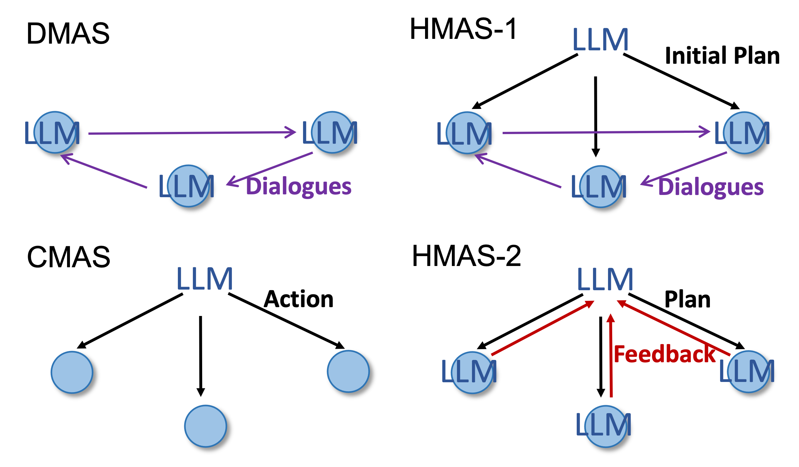

# Multi-Agent-Framework
Here we show the related code for the Multi-Agent Framework paper. The code will be updated dynamically in the future. There are in total four environments, corresponding to BoxNet1, BoxNet2, BoxLift, and Warehouse, respectively.


## Requirements
Please install the following Python packages.
```
pip install numpy openai re random time copy tiktoken
```

Then you need to get your OpenAI key from https://beta.openai.com/
Put that OpenAI key starting 'sk-' into the LLM.py, line8

## Create testing trial environments
Run the env1_create.py/env2_create.py/env3_create.py/env4_create.py to create the environments, remember change the Code_dir_path in the last lines.

```
python env1_create.py
```

## Usage
Run the env1-box-arrange.py/env2-box-arrange.py/env3-box-arrange.py/env4-box-arrange.py to test our approaches in different frameworks and dialogue history methods. In around Line270, set up the models(GPT-3/4), frameworks (HMAS-2,HMSA-1, DMAS,CMAS), dialogue history method, and your working path dir. Then run the script:

```
python env1-box-arrange.py
```

The experimental results will appear in the generated dir Env1_BoxNet1. For visualizing the testing results, set up the Code_dir_path in line2, then run the script:

```
python data_visua.py
```
